# Jenkins with Docker - Example Continuous integration (CI) and Continuous delivery (CD)

### Prerequisites
* Java version 1.8.0_221
* Git version 2.23.0
* Apache Maven 3.6.0
* Jenkins version 2.176.3
* Docker version 19.03.2

## 1.- Create Jenkins Pipeline 

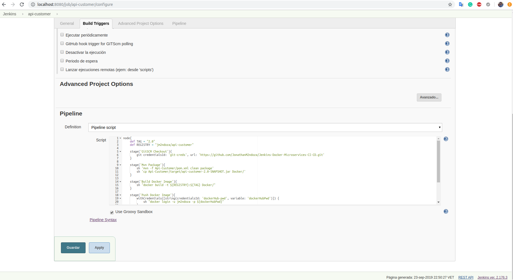

## 2.- Jenkins Build

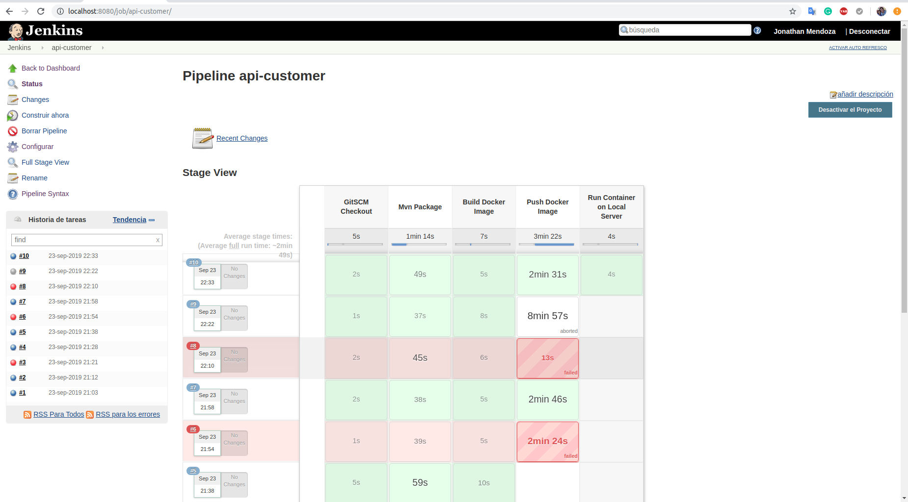

## 3.- Jenkins Credentials

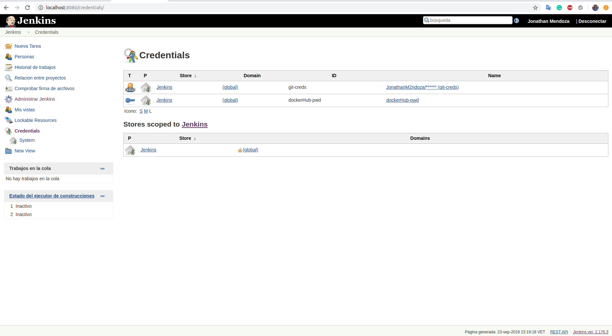

## 4.- Jenkins Status Console

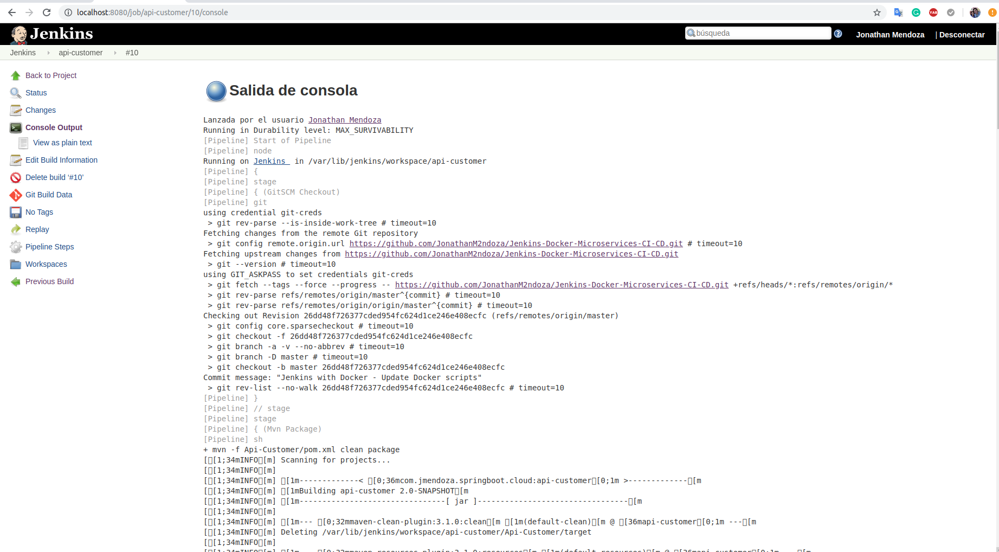

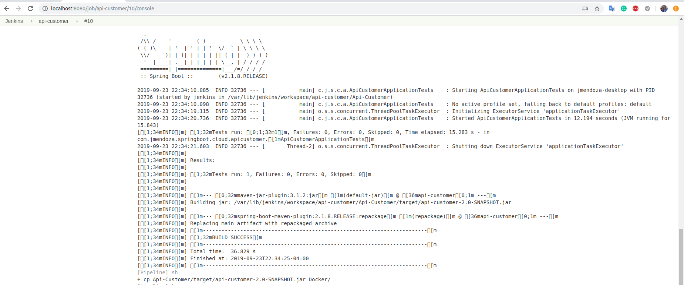

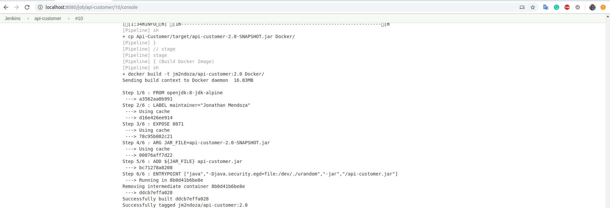

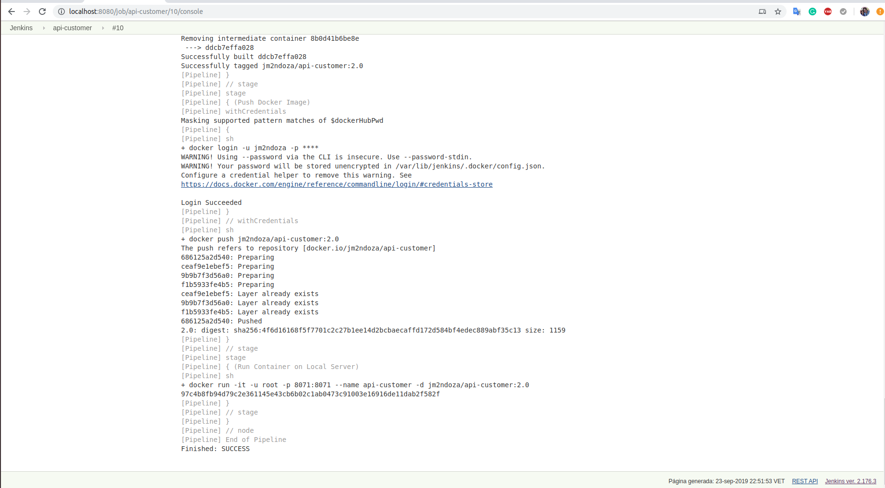

## 5.- Docker Hub 

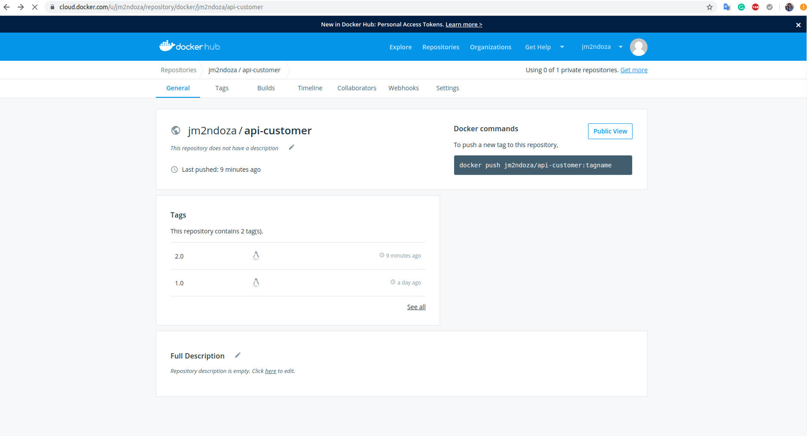

## 6.- Docker images and container (Local Server)

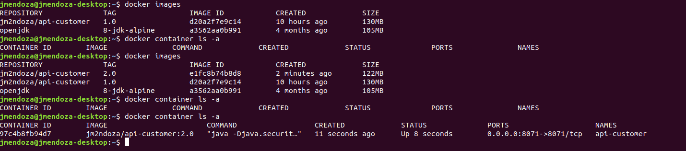

## 7.- Postman - Invoking the API 

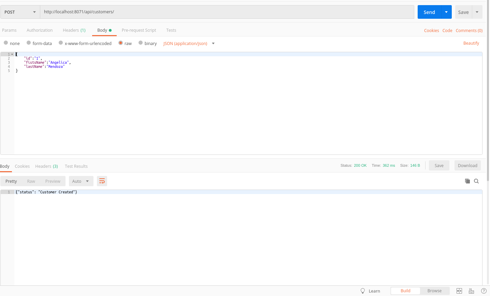

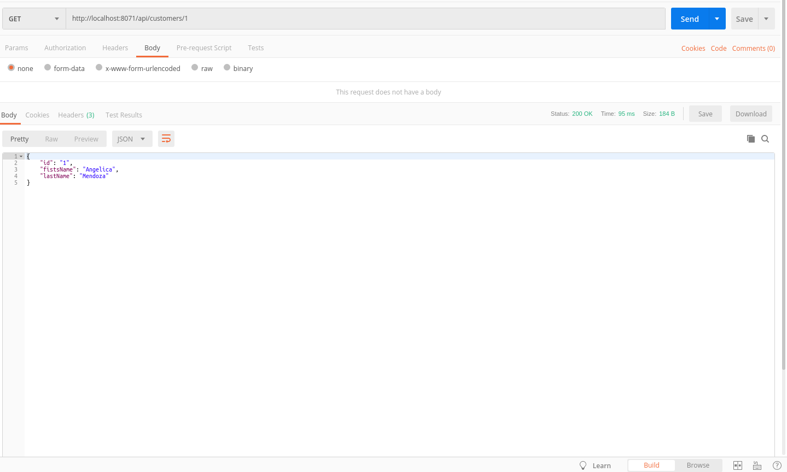

